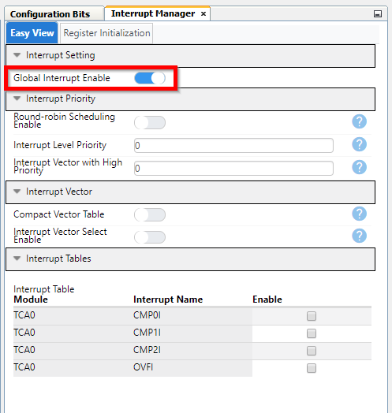

<!-- Please do not change this logo with link -->
[](https://www.microchip.com)

# Blink with Timer Overflow

This code example shows how to use single slope Pulse-Width Modulation (PWM) in the Timer/Counter A (TCA) on the AVR® DB Family of microcontrollers to generate overflow interrupts that toggle a LED. The time between each overflow interrupt is determined by the TCA clock prescaler selection and the value loaded into the period register. Then the overflow interrupt is enabled, and the TCA is started. Inside the interrupt handler function, the LED is toggled. The result is that the amber LED0 on the AVR128DB48 Curiosity Nano development board is blinking with an equal period on and off (50% duty cycle).

<!--  -->
<p>
	
</p>

## Related Documentation

- [AVR128DB48 device page](https://www.microchip.com/wwwproducts/en/AVR128DB48)
- [MPLAB Code Configurator](https://www.microchip.com/en-us/development-tools-tools-and-software/embedded-software-center/mplab-code-configurator)
- [AVR128DB48 Curiosity Nano Hardware User Guide](https://www.microchip.com/DevelopmentTools/ProductDetails/PartNO/EV35L43A)


## Software Used

Microchip’s free MPLAB X IDE, compiler and MPLAB Code Configurator (MCC) graphical code generator are used throughout the application firmware development to provide easy and hassle-free user experience. Following are the tool versions used for this example:

- [MPLAB® X IDE v5.45](https://www.microchip.com/mplab/mplab-x-ide) or newer
- [MPLAB® Xpress IDE](https://www.microchip.com/xpress) (alternative to MPLAB X IDE)
- [XC8 Compiler v2.32](https://www.microchip.com/mplab/compilers) or newer
- [MPLAB® Code Configurator (MCC) v4.1.0](https://www.microchip.com/mplab/mplab-code-configurator) or newer
- [MPLAB® Melody Library 1.37.26 or newer](https://www.microchip.com/mplab/mplab-code-configurator) or newer
- [MCC Device Libraries 8-bit AVR MCUs 2.7.0](https://www.microchip.com/mplab/mplab-code-configurator) or newer
- [Microchip AVR128DB48 Device Support Pack AVR-Dx_DFP 1.2.98](https://packs.download.microchip.com/) or newer


## Hardware Used

- [AVR128DB48 Curiosity Nano](https://www.microchip.com/DevelopmentTools/ProductDetails/PartNO/EV35L43A)


## Peripherals Configuration using MCC

### Added Peripherals

Add the required peripherals:  Timer Counter A (TCA0), Interrupt Manager, and Pin Register


### System Configuration: INTERRUPT MANAGER

In the INTERRUPT MANAGER, global interrupts is enabled. The interrupt associated with TCA0 (overflow) is enabled in the TCA0 configuration, so we will leave that alone in this view.



### System Configuration: PINS

The PINS configuration is made up of two boxes: the *Pins Grid View* and the *Pins* configuration box.

In the *Pins Grid View*, left click on PORTB pin3 in the "Pin Module, GPIO, Output" row.


In the *Pins* configuration box, now the pin you added will show (Pin Name = PB3). In column *Custom Name*, enter "LED0_PIN". The helper functions for PB3 will now get the prefix "LED0_PIN" instead of the default prefix ("IO_PB3"). On the AVR128DB48 Curiosity Nano board this is the pin that controls LED0.


### TCA0 Configuration

- TCA0 must be enabled by turning on "Enable Timer" button. 
- TCA clock should be set to "System Clock / 16". The Timer Clock frequency is automatically calculated and shown. Since we have not made any configuration to system clock, this is set to the default system clock which is 4 MHz. 4 MHz / 16 = 250 kHz (figure below shows System Clock Configuration for reference).


- Timer mode should be set to "16 Bit (Normal)" mode, as we are not using split mode operation (figure is taken from [AVR128DB28/32/48/64 data sheet](http://www.microchip.com/DS40002247) showing TCA normal mode operation).


- Count Direction should be "UP".
- Requested Timeout used in this example is 0.25s. For different periods, use a combination of Clock Selection and Requested Timeout to create the desired period (based on the Clock Selection prescaler value, the possible range for Requested Timeout will change, higher prescaler gives longer timeout options. The actual timeout will be calculated and shown in next line (this should be identical to Requested Timeout in normal mode).
- Turn on "Enable Overflow Interrupt" button to enable overflow interrupts from TCA0.


Now all configuration is complete. You have now enabled global interrupts, set PB3 as output in order to blink the LED and configured the timer (TCA0) to count up to a given value that gives you a certain time period (250 ms), then trigger an overflow interrupt. Next steps are setting up the hardware and programming the device.


## Setup

- Connect the AVR128DB48 Curiosity Nano board to your computer using a USB cable
- Download and install all software components as listed under 'Software Used' (note that MPLAB Xpress IDE is an online tool that cannot be downloaded)


## Operation

1. Download the zip file or clone the example to get the source code
1. Open the .X file with the MPLAB® X IDE
1. Set the project as Main project by right clicking the project name in the *Projects* window (Ctrl+1) and select *"Set as Main Project"* from the drop-down menu
1. Program the project to the AVR128DB48 Curiosity Nano: 
	1. First clean and build the project by pressing the *Clean and Build Main Project* button
	
	
	
	1. Then make and program the project to the AVR128DB48 by clicking the *Make and Program Device Main Project* button
	
	
	
1. To verify that the code is working:
	1. Watch that the amber LED on the Curiosity Nano board is blinking


## Some details regarding the code

The function used to toggle the LED is called *"LED0_PIN_Toggle()"* and is generated by Melody when enabling the PINS configuration. The function (and several others) is found in the *"pins.h"* header file. Note that the function name will change according to the Pin name given in the "Custom Name" cell of PINS setup: *"<pin_name>_Toggle()"* .
	

	
The TCA period (duty cycle for LED0) is given by the value loaded into the TCA0.PER register. The value used in the example is 250 ms. This translates to a TCA0.PER register value as: TCA0.PER = 250 ms / 4 us = 62 500 = 0xF424. By using different TCA clock prescalers and different period values you can make a lot of different duty cycles or periods.
	
The functions related to TCA0 are found in the *tca0.c* file. This screenshot shows the functions that executes the interrupt code:
	


This screenshot shows the actual interrupt handler function (ISR), located further down in the same file:


The TCA0 overflow interrupt handler is not where the actual code that is executed on each interrupt is located.
	
```c
ISR(TCA0_OVF_vect)
{
    if (TCA0_OVF_isr_cb != NULL)
        (*TCA0_OVF_isr_cb)();
    
    TCA0.SINGLE.INTFLAGS = TCA_SINGLE_OVF_bm;
}
```
	
The interrupt handler jumps to a pointer to the function that contains the interrupt code to be executed:
	
```c
void TCA0_DefaultOverflowCallbackRegister(void);
void (*TCA0_OVF_isr_cb)(void) = &TCA0_DefaultOverflowCallbackRegister;
```

Inside this function we add the helper function that toggles PB3 ( which is given the custom name "LED0_PIN") mentioned above.

```c
void TCA0_DefaultOverflowCallbackRegister(void)
{
    //Add your ISR code here
    //When TCA0 overflow interrupt is triggered, toggle output value on LED0 pin (PB3)
    LED0_PIN_Toggle();
}
```

The exact same result can be achieved by placing this code inside the actual interrupt handler. 

	
## Summary

This example shows how to configure the TCA0 for single slope PWM operation with overflow interrupt, using the interrupt handler to toggle a LED.


